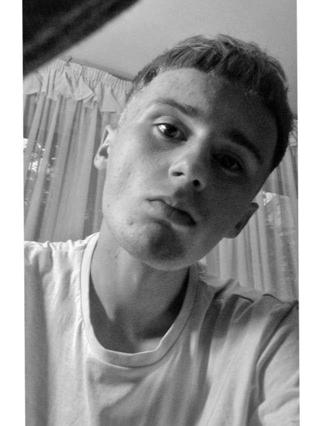

# Junior Frontend Developer
___

Hi! My name is ***Oleg Knysh.***
##### 23 years old 

___

### Contacts for communication with me:
- __Phone number__ +375333718302
- [Instagram](https://www.instagram.com/noncloout/)  
- [Telegram](https://t.me/povetru99) 
- Email: povetru99@gmail.com
-  Discord  OLEG KN#4803

___

***The main goal for me it is learn programming throuhg courses, gain a new knowledge. In the future I would like to work as a programmer.***  
 ___ 

 ### Education

 _I have a high school certificate. I also graduated from Lyceum No. 5 and have a certificate of secondary special education._

 _English language level - A2 Elementary_ 

 _CV thats my first project. Also this task my first experience in programming. I'm so 
impressed._

___

### Work experience

- _HTML and CSS courses on You Tube_
- _RS Schools Course "JavaScript, front-end developer" 2022q2_ 
